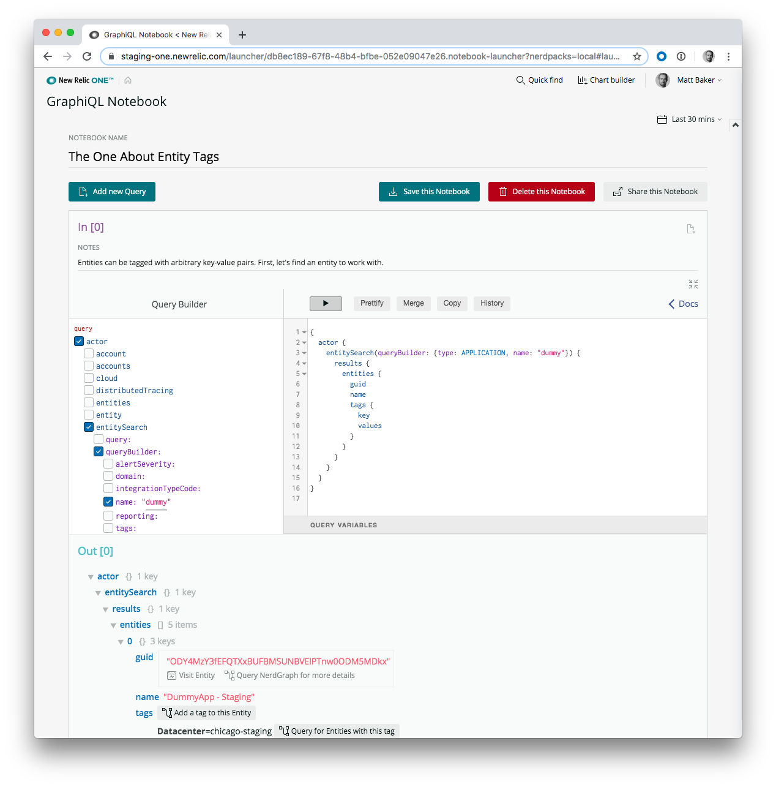
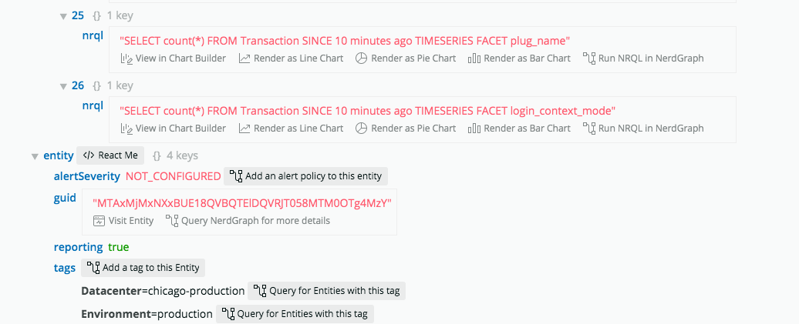

# NR1 GraphiQL Notebook

  [](https://snyk.io/test/github/hospitalrun/hospitalrun-frontend)

## Usage

nr1-graphiql-notebook provides a Jupyter-inspired GraphiQL Notebook utility. Notebooks are composed of cells, each cell is a single, small, GraphiQL instance with its own notes section and rendered output. 

Notebooks can be saved and shared by passing around blocks of Base64-encoded JSON (opaque to the end user).



GraphQL output is rendered with context-aware interactive elements that allow you to explore and learn about the New Relic GraphQL API dynamically. 



If you're eager to jump in, press "Import Notebook" in the UI and paste in this "Getting Started" notebook:

```
eyJjZWxscyI6W3sicXVlcnkiOiJ7XG4gIGFjdG9yIHtcbiAgICB1c2VyIHtcbiAgICAgIGVtYWlsXG4gICAgICBuYW1lXG4gICAgfVxuICB9XG59Iiwibm90ZXMiOiJHcmFwaGlRTCBOb3RlYm9va3MgYXJlIGNvbXBvc2VkIG9mIGNlbGxzLiBBIGNlbGwsIGxpa2UgdGhpcyBvbmUsIGNvbnRhaW5zIGEgc2VjdGlvbiBmb3Igbm90ZXMgYW5kIGFuIGluc3RhbmNlIG9mIHRoZSBHcmFwaGlRTCBxdWVyeSBlZGl0b3IuIExldCdzIHJ1biBhIHF1ZXJ5IHRvIHNlZSB0aGUgb3V0cHV0IOKAlCJ9LHsicXVlcnkiOiJ7XG4gIGFjdG9yIHtcbiAgICBlbnRpdHlTZWFyY2gocXVlcnlCdWlsZGVyOiB7dHlwZTogQVBQTElDQVRJT059KSB7XG4gICAgICByZXN1bHRzIHtcbiAgICAgICAgZW50aXRpZXMge1xuICAgICAgICAgIGd1aWRcbiAgICAgICAgICBhY2NvdW50SWRcbiAgICAgICAgICBuYW1lXG4gICAgICAgICAgdGFncyB7XG4gICAgICAgICAgICBrZXlcbiAgICAgICAgICAgIHZhbHVlc1xuICAgICAgICAgIH1cbiAgICAgICAgICAuLi4gb24gQWxlcnRhYmxlRW50aXR5T3V0bGluZSB7XG4gICAgICAgICAgICBhbGVydFNldmVyaXR5XG4gICAgICAgICAgfVxuICAgICAgICB9XG4gICAgICB9XG4gICAgfVxuICB9XG59XG4iLCJub3RlcyI6IkdyYXBoaVFMIE5vdGVib29rIG91dHB1dCBpcyBcImNvbnRleHQgYXdhcmVcIi4gSXQgY29udGFpbnMgcmVuZGVyZXJzIHRoYXQgdHJ5IHRvIHNob3cgeW91IGludGVyZXN0aW5nIHRoaW5ncyBpbiB0aGUgb3V0cHV0LiBIZXJlJ3MgYW4gZXhhbXBsZSBvZiBhIHF1ZXJ5IHRoYXQgdGFrZXMgYWR2YW50YWdlIG9mIGN1c3RvbSByZW5kZXJpbmcuIn0seyJxdWVyeSI6IntcbiAgYWN0b3Ige1xuICAgIGFjY291bnQoaWQ6IDEpIHtcbiAgICAgIG5ycWwocXVlcnk6IFwiU0VMRUNUIGNvdW50KCopIEZST00gVHJhbnNhY3Rpb24gU0lOQ0UgMTAgbWludXRlcyBhZ29cIikge1xuICAgICAgICBzdWdnZXN0ZWRGYWNldHMge1xuICAgICAgICAgIG5ycWxcbiAgICAgICAgfVxuICAgICAgfVxuICAgIH1cbiAgfVxufVxuIiwibm90ZXMiOiJJbiB0aGlzIG5leHQgZXhhbXBsZSB5b3UnbGwgc2VlIHdlIGRvIGEgTlJRTCBxdWVyeSBhbmQgc2hvdyBzb21lIGludGVyZXN0aW5nIHRoaW5ncyBhYm91dCB0aGUgc3VnZ2VzdGVkIGZhY2V0cy4ifSx7InF1ZXJ5Ijoie1xuICBhY3RvciB7XG4gICAgYWNjb3VudHMge1xuICAgICAgaWRcbiAgICAgIG5hbWVcbiAgICB9XG4gIH1cbn1cbiIsIm5vdGVzIjoiVGhlc2UgcmVuZGVyZXJzIGFyZSBlYXN5IHRvIGFkZCBhbmQgY3VzdG9taXplISBDaGVjayB0aGlzIHByb2plY3QncyByZXBvIFJFQURNRSBmb3IgYSBzYW1wbGUgcmVuZGVyZXIgdGhhdCB3aWxsIHR1cm4gYWNjb3VudCBpZHMgaW50byBsaW5rcy4uLi4ifV0sInV1aWQiOiI5MTYyMDMzNS01MmYzLTQ0MjUtOTczZC1hOGVkMTY3NTFhNjUiLCJ0aXRsZSI6IkdldHRpbmcgU3RhcnRlZCJ9
```

### Renderers

Context-aware rendering is made possible by a set of custom renderers that know how to render certain types or fields. 

Renderers are simply React component classes with an additional static method, `test`, that accepts a node in the output and determines whether it can render that node with a custom representation. You'll find existing renderers in `nerdlets/notebook-nerdlet/renderers`.  Documentation is lacking but you _could_ drop your own renderer in today! 

Here's one you can try out that will link account IDs on account objects to the account page in APM.

Add this file to the `nerdltes/notebook-nerdlet/renderers` directory.

```
import React from 'react';

// Render account IDs as links to the account page in APM
export default class AccountIdRenderer extends React.Component {
  static test(node) {
    let parent = node.__meta.parent
    
    if (!parent) return false

    let isAccountTypeObject = parent.__meta.typename == "Account" ||
                              parent.__meta.typename == "AccountOutline"

    return isAccountTypeObject && node.__meta.fieldName == "id"
  }

  render() {
    let accountId = this.props.node.value
    return <a target="_blank" href={`https://rpm.newrelic.com/accounts/${accountId}`}>
            Visit Account {accountId}
           </a>
  }
}
```

Next, import this class into `nerdlets/notebook-nerdlet/custom-render.js` and add it to `RENDERERS` array.

Now send a query that includes an account ID to see your new renderer in action!

```
{
  actor {
    accounts {
      name
      id
    }
  }
}
```


## Open Source License

This project is distributed under the [Apache 2 license](blob/master/LICENSE).

## What do you need to make this work?

GraphiQL Notebook will work out-of-the-box, but it's most interesting if you have entities you can search for and interact with.

## Getting started

Clone this repository and run the following scripts:

```bash
git clone https://github.com/newrelic/nr1-graphiql-notebook.git
cd nr1-graphiql-notebook
npm install
npm start
```

Visit https://one.newrelic.com/?nerdpacks=local, navigate to the Nerdpack, and :sparkles:

# Support

New Relic has open-sourced this project. This project is provided AS-IS WITHOUT WARRANTY OR SUPPORT, although you can report issues and contribute to the project here on GitHub.

_Please do not report issues with this software to New Relic Global Technical Support._

## Community

New Relic hosts and moderates an online forum where customers can interact with New Relic employees as well as other customers to get help and share best practices. Like all official New Relic open source projects, there's a related Community topic in the New Relic Explorer's Hub. You can find this project's topic/threads here:

https://discuss.newrelic.com/c/build-on-new-relic/nr1-graphiql-notebook
*(Note: URL subject to change before GA)*

## Issues / Enhancement Requests

Issues and enhancement requests can be submitted in the [Issues tab of this repository](issues). Please search for and review the existing open issues before submitting a new issue.

# Contributing

Contributions are welcome (and if you submit a Enhancement Request, expect to be invited to contribute it yourself :grin:). Please review our [Contributors Guide](blob/master/CONTRIBUTING.md).

Keep in mind that when you submit your pull request, you'll need to sign the CLA via the click-through using CLA-Assistant. If you'd like to execute our corporate CLA, or if you have any questions, please drop us an email at opensource@newrelic.com.
